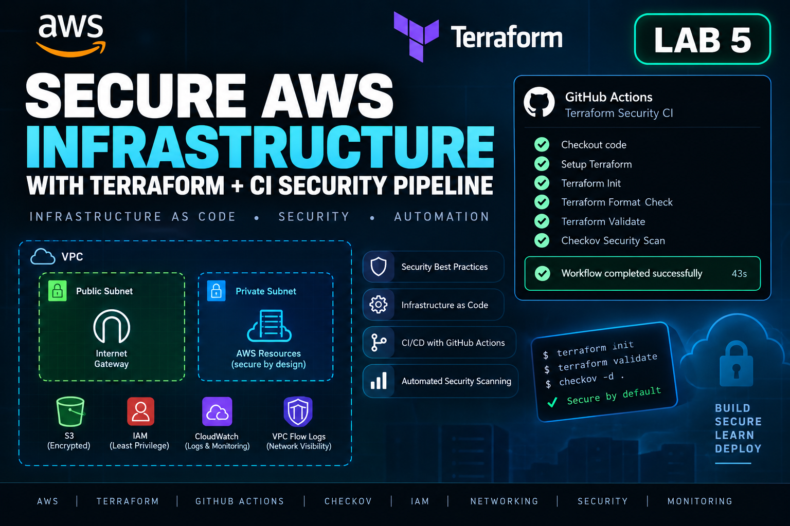
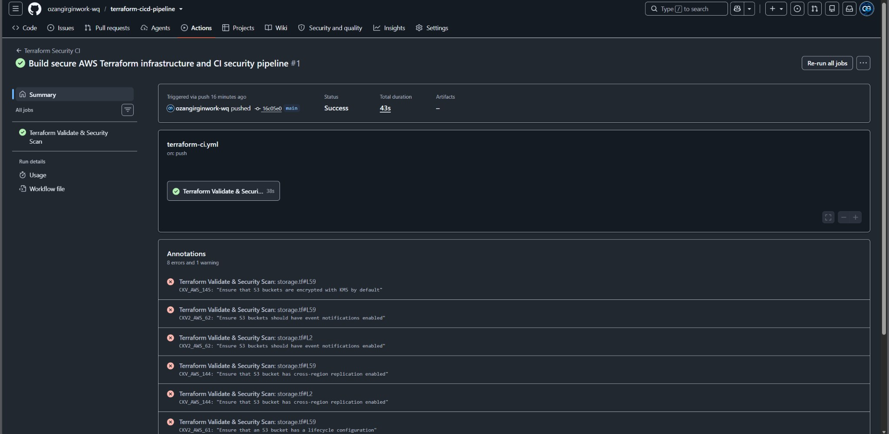
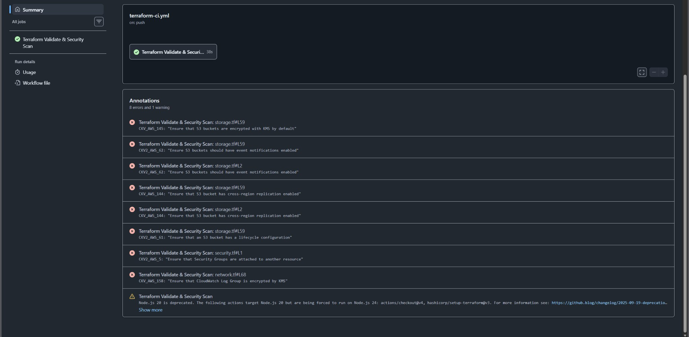

# Secure AWS Infrastructure with Terraform + CI Security Pipeline



A security-focused **Infrastructure as Code (IaC)** portfolio project demonstrating secure AWS architecture with Terraform and automated validation through a GitHub Actions CI security pipeline.

The project emphasizes **secure-by-default design, least privilege, logging, encryption, automated security scanning, deployment safety, and cloud cost awareness**.

## Architecture

The Terraform configuration defines:

- AWS VPC with public and private subnets
- Internet Gateway and controlled routing
- Restricted default security group
- Security group with no inbound access and HTTPS-only outbound traffic
- VPC Flow Logs
- CloudWatch log storage with 365-day retention
- IAM roles and least-privilege policies
- Secure S3 data bucket
- Dedicated S3 access-log bucket
- S3 encryption, versioning, lifecycle controls, and public-access blocking

No EC2 instances, NAT Gateways, load balancers, RDS databases, or other unnecessary compute resources are required.

## Security Controls

Key controls implemented include:

- S3 Block Public Access
- S3 encryption at rest
- S3 versioning
- S3 lifecycle management
- S3 access logging
- IAM least privilege
- Restricted security groups
- Restricted default VPC security group
- VPC Flow Logs
- CloudWatch log retention
- Automated Checkov Infrastructure-as-Code security scanning

## Terraform Structure

```text
.
├── .github/
│   └── workflows/
│       └── terraform-ci.yml
├── evidence/
│   ├── checkov-findings.jpg
│   ├── ci-success.jpg
│   └── lab5-thumbnail.png
├── iam.tf
├── network.tf
├── provider.tf
├── security.tf
├── storage.tf
├── versions.tf
└── README.md
```

## CI Security Pipeline

Every push or pull request to `main` automatically triggers GitHub Actions.

```text
Developer
    ↓
Git Commit / Push
    ↓
GitHub
    ↓
GitHub Actions
    ↓
Terraform Init
    ↓
Terraform Format Check
    ↓
Terraform Validate
    ↓
Checkov IaC Security Scan
    ↓
Security Findings / CI Result
```

The pipeline performs repository checkout, Terraform installation, `terraform init -backend=false`, `terraform fmt -check -recursive`, `terraform validate`, and Checkov Terraform security scanning.

This provides automated validation and security feedback whenever infrastructure code changes while deliberately avoiding automatic AWS deployment.

## Evidence

### GitHub Actions CI Pipeline

The pipeline validates Terraform formatting and configuration and runs the Checkov security scan automatically.



### Checkov Security Analysis

The original evidence screenshot recorded this historical local scan:

- **61 passed checks**
- **8 identified findings**
- **0 skipped checks**



The current pipeline fails on unreviewed findings. Accepted exceptions are attached to specific resources with reasons in the Terraform source, so a new failure on another resource is not globally suppressed. Examples include cross-region S3 replication, S3 event notifications, customer-managed KMS encryption for selected logging resources, and security-group attachment to compute resources.

Some controls would require additional AWS services, resources, operational complexity, or potential cost that are outside the scope of this deliberately cost-conscious lab. This demonstrates an important security-engineering principle: **scanner findings require risk analysis and architectural context rather than automatic remediation**.

## Deployment Safety

The CI pipeline intentionally does **not** execute `terraform apply` and does not require AWS credentials or long-lived cloud secrets.

Its purpose is to validate and security-scan infrastructure code without automatically provisioning AWS resources.

A production deployment pipeline could extend this design with Terraform plan review, GitHub OIDC authentication to AWS, protected environments, manual approval gates, and controlled `terraform apply`.

This separation reduces the risk of unintended infrastructure creation and cloud charges during the lab.

## Cost Considerations

The project was designed to minimize AWS cost. Expensive or unnecessary components such as NAT Gateways, EC2 instances, Elastic IPs, load balancers, and RDS were deliberately excluded.

Some defined services, including CloudWatch logging and VPC Flow Logs, may incur charges if deployed and used. The CI pipeline performs static validation and security scanning without deploying the infrastructure.

## What This Project Demonstrates

- Terraform Infrastructure as Code
- AWS networking and security architecture
- IAM least privilege
- Secure S3 configuration
- AWS logging and monitoring concepts
- Git and GitHub workflow
- GitHub Actions CI
- Automated IaC security scanning with Checkov
- Security finding analysis and risk-based remediation decisions
- Cloud cost awareness
- Secure infrastructure lifecycle practices

## Lessons Learned

Cloud security is not simply about making every automated scanner check green. Security controls must be evaluated against architecture, operational requirements, risk, and cost.

Automating Terraform validation and security scanning through CI provides early feedback before infrastructure reaches a deployment stage, while separating validation from deployment reduces unnecessary cloud exposure and accidental cost.
## Review improvements

- Added S3 access-log delivery permission restricted by source bucket ARN and account, plus HTTPS-only bucket policies.
- Added access-log lifecycle expiration for both current and noncurrent versions.
- Explicitly associated the private subnet with an isolated route table.
- Corrected Flow Logs permissions: `DescribeLogGroups` uses its required wildcard scope; stream operations remain scoped to the lab log group.
- Replaced global Checkov soft-fail with resource-specific exceptions. CI success means enabled checks passed; it does not mean every possible production control is implemented.

### Accepted scanner exceptions

| Check | Resource | Lab decision |
|---|---|---|
| CKV_AWS_158 | Flow log group | Service encryption; no customer-managed KMS key |
| CKV2_AWS_5 | Security group | No compute workload provisioned |
| CKV2_AWS_62 | Both S3 buckets | No application notification consumer |
| CKV_AWS_144 | Both S3 buckets | Single-region lab; no cross-region replication |
| CKV_AWS_145 | Access-log bucket | SSE-S3 log encryption |

Review these exceptions before adapting the configuration to production. Original screenshots remain historical evidence, not a current deployment or scan result.

### Validate locally without deployment

```bash
terraform init -backend=false -input=false
terraform fmt -check -recursive
terraform validate
checkov -d . --framework terraform
```

### Cleanup after an optional deployment

Use the original state and review `terraform plan -destroy` before running `terraform destroy`. S3 buckets containing objects or versions may block destruction. Stop lab log producers, review any evidence you need to keep, then empty only the identified lab buckets, including versions and delete markers, before retrying. Do not delete state as a substitute for deleting resources. Check the AWS account for remaining lab buckets and log groups afterward.

[S3 log delivery permissions reference](https://docs.aws.amazon.com/AmazonS3/latest/userguide/enable-server-access-logging.html).

## Related portfolio labs

[Lab 1: Linux support & troubleshooting](https://github.com/ozangirginwork-wq/linux-it-support-troubleshooting-lab) · [Lab 2: Windows Server & Active Directory](https://github.com/ozangirginwork-wq/windows-server-active-directory-lab) · [Lab 3: Python IT automation](https://github.com/ozangirginwork-wq/python-it-cloud-automation-lab) · [Lab 4: AWS security incident investigation](https://github.com/ozangirginwork-wq/aws-security-incident-response-lab) · [Lab 6: AWS automated incident response](https://github.com/ozangirginwork-wq/aws-security-automated-incident-response)
