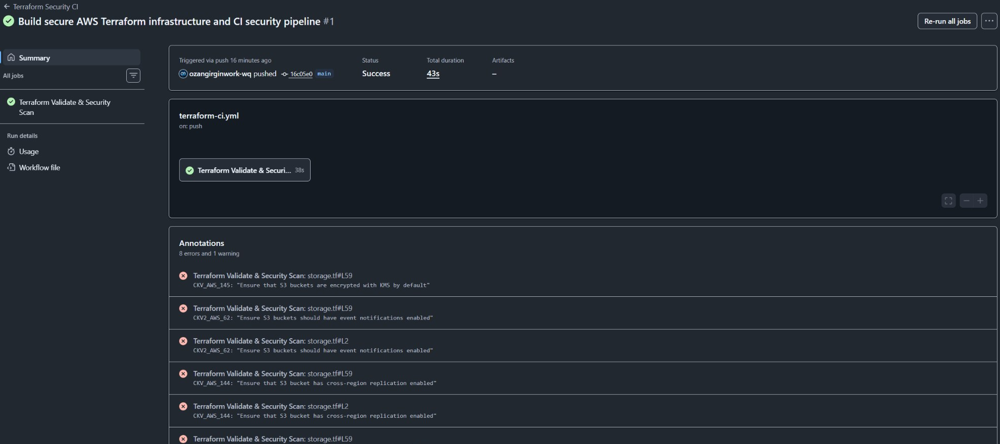
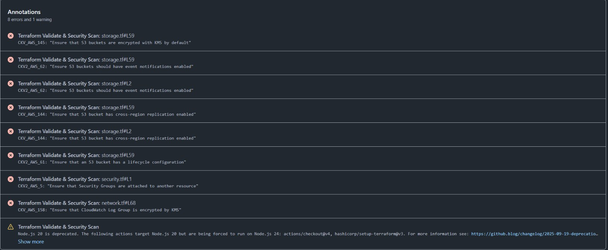
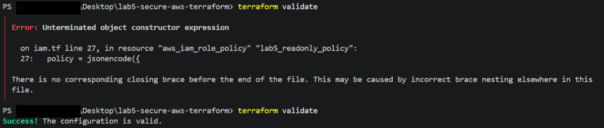

# Evidence highlights

Three focused views from the original lab work, curated on September 25, 2026. These are historical captures, not new test runs or proof of a currently deployed environment.

The images are cropped to the relevant output. Solid black blocks mark redacted identifiers; commands and results have not been rewritten. Local lab names, private addresses and public service endpoints are retained where useful.

## 1. Historical CI run and its findings

The early Actions run is marked Success while scanner annotations remain visible. A green historical workflow is not proof of zero security findings; the current workflow's exception handling is documented in the main README.

## 2. Original Checkov annotations

The original Actions view lists eight errors and one warning. These historical findings are retained for context and do not describe the current scan result.

## 3. Terraform syntax error and recovery

The original terminal shows an unterminated object constructor in iam.tf followed by a successful terraform validate. This validates configuration syntax, not AWS deployment.

## Source and integrity notes

Crops were reviewed for readability and sensitive data before publication. Hashes below identify the published crops, not the unedited sources. Existing source captures elsewhere in the repository are retained.

| Published crop | SHA-256 |
| --- | --- |
| `01-historical-ci.png` | `b098ddbcb5907277c678948016f596b54a3175535fbc97f039ca28be2e68544f` |
| `02-checkov-findings.png` | `abc9bef966fa90545277b7b589f693d61aa5d4f3d38638128ce87743fe577a80` |
| `03-terraform-validation-recovery.png` | `bb9d53f6d97f8050e0d6b399829d1a9b3b39ef088e0e9159da4083fa4979e89d` |

[Back to project](../../README.md)
